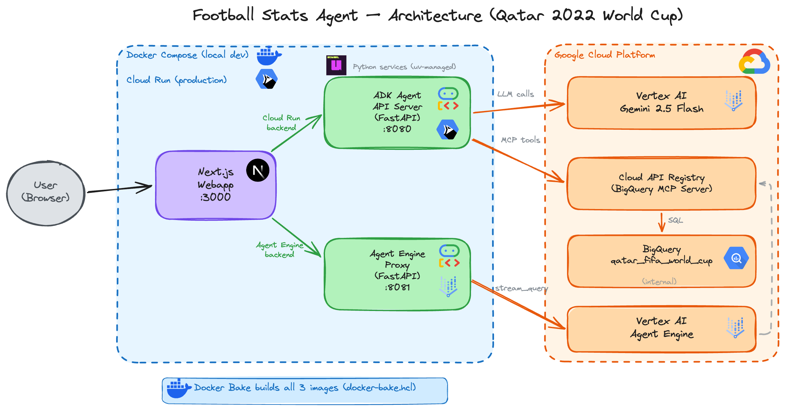

# Football Stats Agent - Qatar 2022 World Cup

An AI-powered football statistics assistant built with **Google Agent Development Kit (ADK)**, **BigQuery MCP** via Cloud API Registry, and **Gemini 2.5 Flash**. Ask natural language questions about the Qatar 2022 World Cup and get instant answers backed by real data.

## Architecture



The project consists of 3 services:

| Service | Description | Tech |
|---------|-------------|------|
| **ADK Agent API** | REST API exposing the football stats agent | Google ADK, FastAPI, Python |
| **Agent Engine Proxy** | Proxy for Vertex AI Agent Engine streaming API | FastAPI, Python |
| **Webapp** | Chat UI with backend toggle | Next.js, TypeScript |

Two deployment paths to Google Cloud:
- **Cloud Run** -- Stateless REST API via `adk api_server`
- **Vertex AI Agent Engine** -- Managed agent with Playground UI

## Tech Stack

- **Agent Framework**: [Google ADK](https://github.com/google/adk-python) (`LlmAgent`)
- **LLM**: Gemini 2.5 Flash via Vertex AI
- **Data**: BigQuery (accessed via Cloud API Registry MCP Server)
- **Frontend**: Next.js 15 with Tailwind CSS
- **Package Manager**: [uv](https://github.com/astral-sh/uv)
- **Containers**: Multi-stage Docker builds, Docker Bake, Docker Compose
- **CI/CD**: Cloud Build with registry-based layer cache
- **Infrastructure**: Cloud Run, Artifact Registry, Vertex AI Agent Engine

## Prerequisites

- Python 3.11+
- [uv](https://docs.astral.sh/uv/getting-started/installation/)
- [direnv](https://direnv.net/)
- [Google Cloud SDK](https://cloud.google.com/sdk/docs/install)
- [Docker Desktop](https://www.docker.com/products/docker-desktop/)
- Node.js 22+ (for webapp local dev)
- A GCP project with BigQuery, Vertex AI, and Cloud API Registry enabled

## Dataset

The `raw_data/` folder contains the Qatar 2022 World Cup player statistics in NDJSON format and a script to load it into BigQuery.

```bash
# Upload the NDJSON file to a GCS bucket, then:
export PROJECT_ID=your-gcp-project-id
export REGION=europe-west1
export BUCKET_PATH=your-bucket-name/path

./raw_data/create_and_load_team_stats_raw_table.sh
```

This creates the `qatar_fifa_world_cup.team_players_stat_raw` table with auto-detected schema.

## Quick Start

### 1. Clone and setup environment

```bash
direnv allow   # Loads env vars + creates/activates .venv
uv sync        # Install Python dependencies
```

### 2. Authenticate with GCP

```bash
gcloud auth application-default login
```

### 3. Run the agent locally

```bash
uv run adk web
```

Open http://localhost:8000 to interact with the agent.

### 4. Run all services with Docker Compose

```bash
docker buildx bake      # Build all 3 images
export ENGINE_ID=your-engine-id   # Required by the proxy
docker compose up        # Start all services
```

| Service | URL |
|---------|-----|
| ADK Agent API | http://localhost:8080/docs |
| Agent Engine Proxy | http://localhost:8081/health |
| Webapp | http://localhost:3000 |

## Deployment

### Cloud Build (CI/CD)

Deploy everything in a single pipeline:

```bash
gcloud builds submit --config deploy-services-to-cloud-run.yaml --project gb-poc-373711 --region europe-west1
```

This pipeline uses Cloud Build predefined substitutions (`$PROJECT_ID`, `$LOCATION`) and runs 3 steps:
1. **Build & push** — Docker Bake builds all 3 images with registry cache
2. **Deploy Agent Engine** — Installs `google-adk` via uv and deploys the agent to Vertex AI
3. **Deploy Cloud Run** — Deploys all 3 services (ADK API, Agent Engine Proxy, Webapp)

### Manual Deployment

```bash
# ADK Agent API to Cloud Run
./deploy_api.sh

# Agent Engine Proxy to Cloud Run
cd agent_engine_proxy && ./deploy.sh

# Agent to Vertex AI Agent Engine
./deploy_agent_engine.sh
```

## Project Structure

```
.
├── football_stats_agent/
│   ├── __init__.py                  # Package init
│   └── agent.py                     # Agent definition (LlmAgent + BigQuery MCP)
├── webapp/                          # Next.js chat UI
│   ├── app/                         # App router (pages + API routes)
│   ├── components/                  # React components
│   ├── hooks/                       # Custom hooks
│   ├── Dockerfile                   # Multi-stage Next.js build
│   └── package.json
├── agent_engine_proxy/              # FastAPI proxy for Agent Engine
│   ├── main.py                      # /query endpoint with retry logic
│   ├── Dockerfile                   # Multi-stage build with uv
│   ├── pyproject.toml               # Dependencies (uv-managed)
│   └── deploy.sh                    # Cloud Run deployment
├── raw_data/                        # Dataset + BigQuery load script
│   ├── world_cup_team_players_stats_raw_ndjson.json
│   └── create_and_load_team_stats_raw_table.sh
├── diagrams/                        # Architecture diagrams
├── deploy_agent_engine.sh           # Vertex AI Agent Engine deployment
├── deploy_api.sh                    # Cloud Run deployment (local)
├── deploy-services-to-cloud-run.yaml # Cloud Build CI/CD pipeline
├── Dockerfile                       # ADK agent multi-stage build with uv
├── docker-bake-agentic-apps.hcl                  # Docker Bake (centralized builds + registry cache)
├── docker-compose.yaml              # Local dev (all 3 services)
├── .envrc                           # Environment variables (direnv)
├── pyproject.toml                   # Python dependencies
└── uv.lock                         # Lockfile
```

## IAM Permissions

The following roles are required for the user and relevant service accounts:

| Role | Purpose |
|------|---------|
| `roles/mcp.toolUser` | Access MCP tools via Cloud API Registry |
| `roles/cloudapiregistry.viewer` | Discover MCP servers |
| `roles/bigquery.dataViewer` | Read BigQuery data |
| `roles/bigquery.jobUser` | Run BigQuery queries |
| `roles/aiplatform.user` | Call Vertex AI models and Agent Engine |
| `roles/storage.objectAdmin` | Manage deployment staging bucket |

## Example Queries

- "Who scored the most goals in the 2022 World Cup?"
- "Show me the top 5 players by assists"
- "Which goalkeepers had the highest save percentage?"
- "Compare France and Argentina players by performance rating"
- "What is the team style of Brazil based on their stats?"

## Blog & Video

This project accompanies a blog article and video tutorial about building AI agents with Google ADK and BigQuery MCP on Google Cloud.
